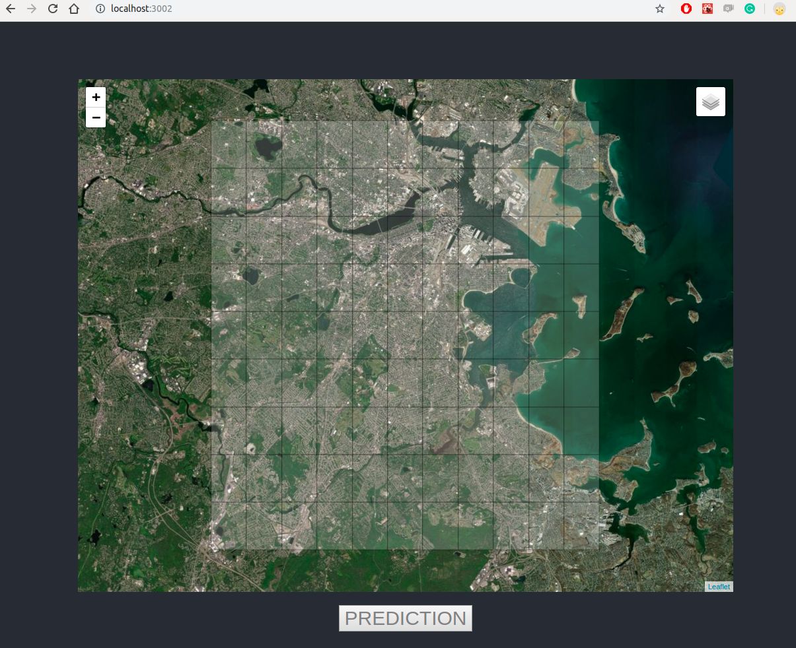

# Crimen

## Contenido

- Introduccion
- Intruciones de uso
- Links

## Introduccion

Este proyecto de machine learning, tiene como objectivo generar un prototipo de servicio para predecir un tipo de crimen, tomando como variables, hora, dia, mes y lugar. Los datos de prueba que se usaron son de Kaggle y de la pagina de data.boston.

## Intruciones de uso

Antes de iniciar debemos tener instaldo docker y docker-compose en nuestro equipo para moder inicar el prototipo.

Una vez instaldos docker y docker-compose iniciamos con descargar los datos que son necesarios.

Ejecutamos el siguiente comando que se encargara de bajar los datos y crear las carpetas necesarias.

```
# cd download-files
# ./donwload-files.sh
```

Ya que se descargan los datos, ahora procedemos a iniciar el prototipo con el siguente comando de docker-compose.

```
# docker-compose up -d
```

El comando se encargada de todo lo nesario para que inicie. La primera vez toma su tiempo ya que es necesrio crear las imagenes y descargar las dependencias.

En la linea de comandos debemos ver algo similar

```
Creating crime-db ... done
Creating crime-back-end  ... done
Creating crime-front-end ... done
```

Nos aseguramos de que la base ya termine de importar los datos.

```
# docker-compose logs --tail=7
```

Y esperamos ver algo similar

```
crime-db | PostgreSQL init process complete; ready for start up.
crime-db |
crime-db | 2019-11-10 19:04:06.305 UTC [1] LOG:  listening on IPv4 address "0.0.0.0", port 5432
crime-db | 2019-11-10 19:04:06.306 UTC [1] LOG:  listening on IPv6 address "::", port 5432
crime-db | 2019-11-10 19:04:06.311 UTC [1] LOG:  listening on Unix socket "/var/run/postgresql/.s.PGSQL.5432"
crime-db | 2019-11-10 19:04:06.338 UTC [210] LOG:  database system was shut down at 2019-11-10 19:04:06 UTC
crime-db | 2019-11-10 19:04:06.348 UTC [1] LOG:  database system is ready to accept connections
```

En este momento ya podemos probar el servicio. Entramos al navegador Chrome y accedemos a http://localhost:3002/



## Links

- [Datos](https://www.kaggle.com/AnalyzeBoston/crimes-in-boston) - Kaggle Boston crime.
- [Datasets](https://data.boston.gov/dataset) - Datos de boston.
